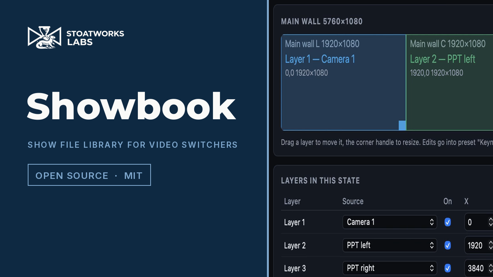
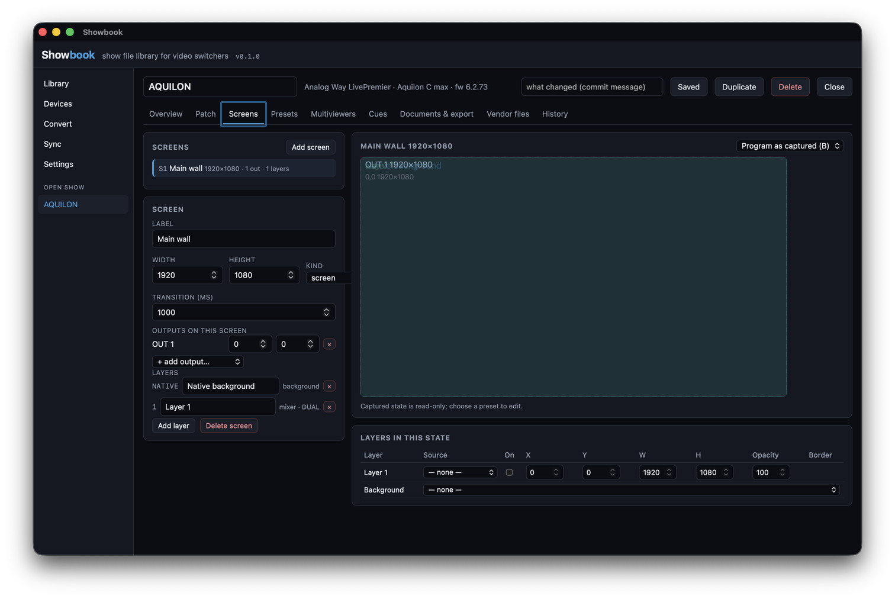
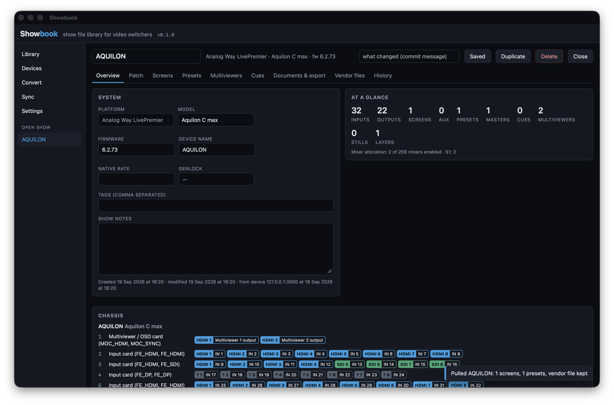

# Showbook

> **AI-assisted project.** This codebase was created with [Claude Code](https://claude.com/claude-code)
> (Anthropic), directed and reviewed by a human author. The two drivers were built against the
> vendors' own simulators — Barco's Event Master Toolset simulator (E2 9.2 and Encore3 10.0)
> and Analog Way's LivePremier, Midra 4K and Alta 4K simulators — and the published protocol
> guides. **Nothing here has been run against a physical switcher yet.** See [Status](#status)
> for exactly what has been exercised and what has not.
>
> **In development.** v0.1.0 is the first tagged build — it works, it moves, and its drivers
> are waiting on real hardware. The [user guide](docs/USER-GUIDE.md) says what each part
> does and what it has been checked against.

A desktop show file library for video switchers. Keep every show for your **Barco Event
Master** (E2, S3-4K, EX, Encore3) and **Analog Way LivePremier** (Aquilon), with version
history; inspect the patch, the screens, the layers and the presets; generate PDF
documentation, test patterns, multiviewer layouts and Companion pages; convert a show
between platforms with an honest report of what carried, what was adapted and what was
dropped; and pull from or push to the live hardware.

Not affiliated with or endorsed by Barco or Analog Way.

[](https://www.youtube.com/watch?v=nBeDnpbuLwc)

*A 50-second tour. Every frame is the real application, recorded on screen and driven over
macOS accessibility. The show is the LivePremier simulator's Aquilon C max pull, prepared
for an event in Showbook — which is why the History tab at the end has three real versions.*





<!-- downloads:start -->

## Download

**[v0.1.1](https://github.com/stoatworks-labs/showbook/releases/tag/v0.1.1)** — prebuilt for macOS, Windows and Linux. Pick your platform:

<details>
<summary><b>macOS</b> — Universal (Apple Silicon + Intel)</summary>

| Build | Download | Size |
| --- | --- | --- |
| Universal (Apple Silicon + Intel) · .dmg disk image | [`Showbook_0.1.1_universal.dmg`](https://github.com/stoatworks-labs/showbook/releases/download/v0.1.1/Showbook_0.1.1_universal.dmg) | 11 MB |

</details>

<details>
<summary><b>Windows</b> — x64</summary>

| Build | Download | Size |
| --- | --- | --- |
| x64 · .exe installer | [`Showbook_0.1.1_x64-setup.exe`](https://github.com/stoatworks-labs/showbook/releases/download/v0.1.1/Showbook_0.1.1_x64-setup.exe) | 4.4 MB |

</details>

<details>
<summary><b>Linux</b> — x64</summary>

| Build | Download | Size |
| --- | --- | --- |
| x64 · .deb package (Debian/Ubuntu) | [`Showbook_0.1.1_amd64.deb`](https://github.com/stoatworks-labs/showbook/releases/download/v0.1.1/Showbook_0.1.1_amd64.deb) | 6.5 MB |
| x64 · .rpm package (Fedora/RHEL) | [`Showbook-0.1.1-1.x86_64.rpm`](https://github.com/stoatworks-labs/showbook/releases/download/v0.1.1/Showbook-0.1.1-1.x86_64.rpm) | 6.5 MB |

</details>

Also in this release:

- [`Showbook_0.1.1_universal.app.tar.gz`](https://github.com/stoatworks-labs/showbook/releases/download/v0.1.1/Showbook_0.1.1_universal.app.tar.gz) — macOS app bundle (updater archive; the .dmg is the install), 11 MB

All builds, checksums and release notes: [github.com/stoatworks-labs/showbook/releases](https://github.com/stoatworks-labs/showbook/releases).

macOS builds are signed and notarised and open normally. The Windows builds are unsigned, so SmartScreen warns once.

<!-- downloads:end -->

## What it does

| | |
|---|---|
| **Library** | Plain files on disk: `shows/<id>/show.json`, a gzip'd snapshot per saved version, the vendor files. Put the folder in Dropbox / OneDrive / Google Drive and their desktop clients carry it; or let Showbook sync it over the drives' APIs. |
| **Import** | Event Master backup archives (`E3Backup.tar.gz`, zips, the frame's `xml/` folder, a bare `settings.xml`), LivePremier `.awc` files, a saved Web RCS device store (`.json`), Showbook's own `.json`. |
| **Devices** | Pull the running show from an Aquilon (the Web RCS device store, plus its `.awc`), a Midra 4K or Alta 4K, or an Event Master frame (JSON-RPC, plus the Encore3 backup archive). Push labels and restore an `.awc` on a LivePremier; recall presets, cues and TAKE on either. |
| **Inspect** | Chassis with every connector and what is on it; inputs, outputs and sources; each screen drawn to scale with its outputs and layers; presets per screen; multiviewer layouts; cues. |
| **Edit** | Labels, formats, patch, screen size and outputs, layers, preset layer rects (drag on the canvas), master presets, cues, multiviewer windows. Every save is a version; every version diffs against the last and can be restored. |
| **Document** | A PDF: cover, chassis and patch tables, one page per screen and per preset drawn to scale, multiviewer layouts, cues, a glossary of what the settings mean, the import notes, the version history. |
| **Test patterns** | One PNG per output at the output's raster, labelled with the output, its connector, its screen and its position on the canvas, with arrows to its neighbours; one per screen showing the whole canvas. |
| **Convert** | Event Master ↔ LivePremier (and descriptors for Midra 4K, Alta 4K, LiveCore, PDS-4K, PixelHue): the show is re-keyed in the target's own spelling and held against its capacity; multi-screen presets become memories plus a master memory and back; every dropped feature is named. |
| **Companion** | A Bitfocus Companion page — TAKE per screen, one button per preset / master memory / cue — for the `barco-eventmaster` or `analogway-awj` module; and reading a page back to check which buttons still match the show. |

## Running it

Prebuilt apps for macOS, Windows and Linux are in the [Download](#download) section. From
source:

```bash
npm install
npm run app          # tauri dev
npm run app:build    # release bundle for this platform
```

Open a browser tab at the Vite dev server instead and you get a demo with two simulator
captures in memory — every screen works, but files and devices need the desktop app.

## Status

What has been checked, and against what:

- **Event Master store parsing** — `settings.xml` from the Encore3 10.0.2 simulator (six
  screens, six outputs, two multiviewers, the Tri-Combo and HDMI 2.0 cards) and the E2 9.2
  simulator; a packed `E3Backup.tar.gz` round trip. **No preset or cue file has been seen** —
  the simulators never had one saved — so `presets/*.xml` and `cues/*.xml` are parsed
  structurally and every unrecognised part is reported in the show's notes. A first real
  backup will say what it did not understand; treat preset content from a backup as
  provisional until then.
- **Event Master live** — the JSON-RPC client follows Barco's API guide and the Bitfocus
  module's use of it; the simulators do not serve the API, so it has not answered a request.
  The Encore3 backup download (`/api/backup`) is the endpoint the toolset uses; unverified.
- **LivePremier** — read from the LivePremier simulator 6.2.73 (`NLC_CMAX`): the device store
  into the model, the REST API (`/api/tpp/v1`), an `.awc` downloaded, uploaded back and
  extracted (`DONE`), AWJ reads and writes. *Apply* of an uploaded `.awc` reboots the device
  and was not run. Deep capture (recalling each memory into preview to read its layers) is
  built and never run.
- **Midra 4K / Alta 4K** — the store parser reads the Pulse 4K 3.2.29 and Zenith 200 1.3.7
  simulators live (inputs, outputs, screens with layers, memories, master memories,
  multiviewer). Writes and REST recalls reuse the LivePremier code and are unverified there.
- **Conversion, Companion export, PDF, patterns, library, history, folder sync** — unit
  tested; the PDF and a pull were also produced from the running desktop app.
- **Cloud sync** — Dropbox, Google Drive and OneDrive providers follow their public API
  references with OAuth PKCE on a loopback redirect; they need an app registration only the
  account holder can make and have not been run against a live account.
- **Companion** — the page export matches the control shape Companion 5.0.5 saves and the
  action ids in the installed modules, but has not yet been imported into a running Companion.

The `.awc` is encrypted; Showbook keeps it as an opaque vendor file and does not read inside
it. Restoring an Event Master backup onto a frame is done from the Event Master Toolset;
Showbook exports the archive for it.

## Layout

```
src/                     React front end (types.ts mirrors the Rust model)
src-tauri/src/lib.rs     the Tauri commands, thin
src-tauri/crates/
  showbook-model         the brand-neutral show model, diff, validation
  showbook-em            Event Master: XML store, backup archives, JSON-RPC
  showbook-aw            Analog Way: device store (LivePremier and Midra/Alta), REST, AWJ, .awc
  showbook-library       the on-disk library, history, sync providers, OAuth
  showbook-convert       capability tables and the conversion
  showbook-companion     Companion page export/import
fixtures/                simulator captures the tests run on
docs/NOTES.md            what was learned building it, including the traps
```

<!-- attributions:start -->
This project is built on other people's work — see [ATTRIBUTIONS.md](ATTRIBUTIONS.md).
<!-- attributions:end -->

## Licence

MIT. See [ATTRIBUTIONS.md](ATTRIBUTIONS.md) for what it is built on.
